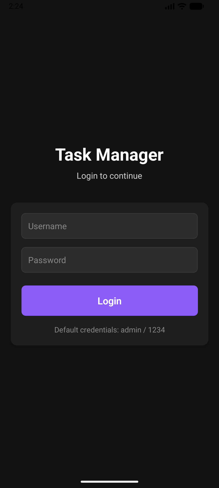
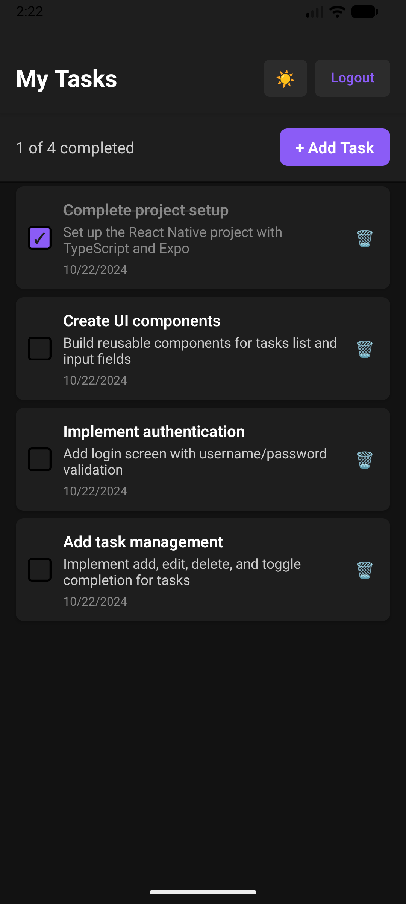
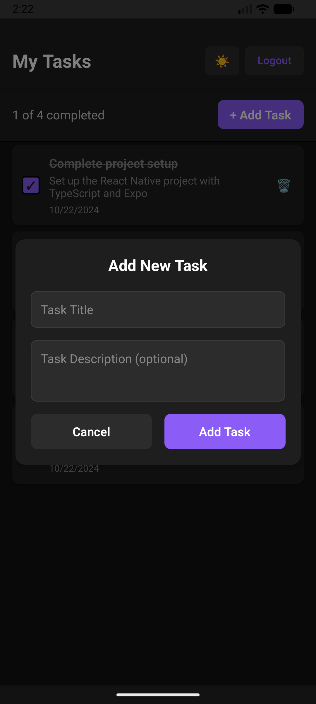
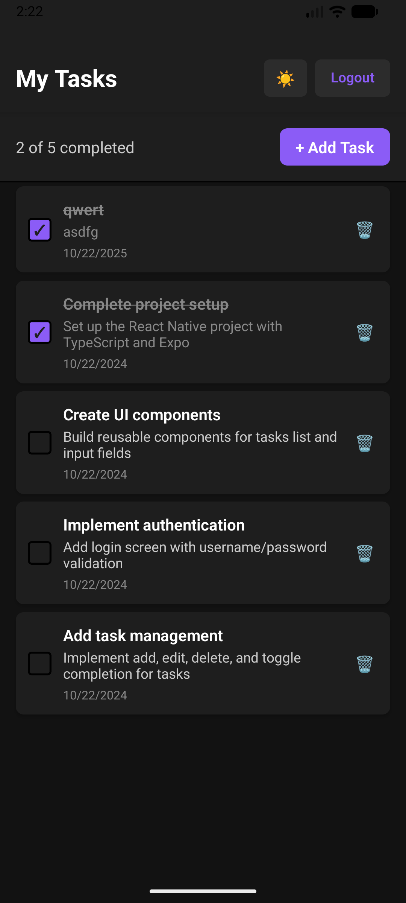
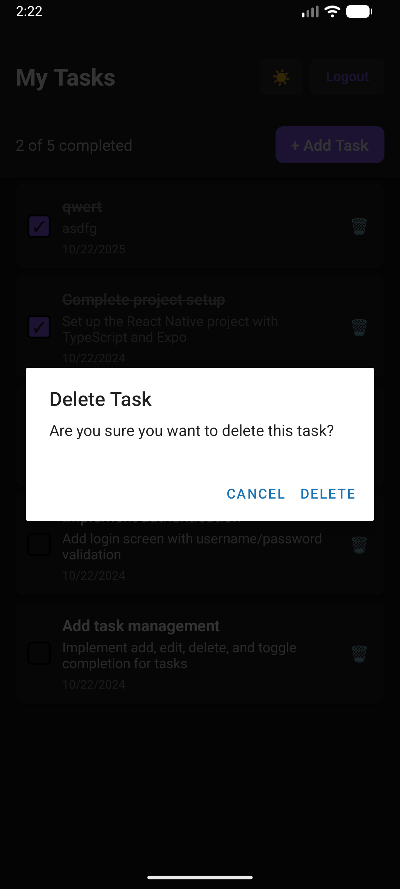

# Task Manager - Менеджер задач

**Полнофункциональное мобильное приложение для управления задачами с аутентификацией пользователей и поддержкой темной темы.**

# Возможности

# Аутентификация
- Безопасный вход в систему с валидацией
- Стандартные учетные данные: `admin` / `1234`

# Управление задачами
- Просмотр списка задач с детальной информацией
- Добавление новых задач через модальное окно
- Отметка задач как выполненных/невыполненных
- Удаление задач с подтверждением
- Статистика выполнения задач в реальном времени

# Темы и интерфейс
- **Светлая и темная темы** с автоматическим переключением
- Современный и интуитивный дизайн
- Адаптивный интерфейс для всех размеров экранов
- Плавные анимации и переходы

# Дополнительные функции
- Pull-to-refresh для обновления данных
- Оптимизированная производительность
- Полная поддержка TypeScript

# Стек технологий

| Framework                                                                                                 | Language                                                                                       | State Management                                                             | Navigation                                                                                                    | Permissions & Geo                                                                                                                                           | Storage & Caching                                                                                                      | UI & Styling                                                                                                      | Linting & Formatting                                                                                                                                                        | Testing                                                                                                                                                                                      |
| --------------------------------------------------------------------------------------------------------- | ---------------------------------------------------------------------------------------------- | ---------------------------------------------------------------------------- | ------------------------------------------------------------------------------------------------------------- | ----------------------------------------------------------------------------------------------------------------------------------------------------------- | ---------------------------------------------------------------------------------------------------------------------- | ----------------------------------------------------------------------------------------------------------------- | --------------------------------------------------------------------------------------------------------------------------------------------------------------------------- | -------------------------------------------------------------------------------------------------------------------------------------------------------------------------------------------- |
|  |  |  |  |  |  |  |  |  |


# Быстрый старт

# Предварительные требования
- **Node.js** версии 16 или выше
- **npm** или **yarn** менеджер пакетов
- **Expo CLI** для разработки
- **Android Studio** (для Android эмулятора)
- **Xcode** (для iOS эмулятора, только macOS)

# Установка и запуск

1. **Клонируйте проект:**
   ```bash
   git clone <repository-url>
   cd TaskManagerApp
   ```

2. **Установите зависимости:**
   ```bash
   npm install
   ```

3. **Запустите эмулятор Android:**
   ```bash
   # Запустите эмулятор Medium Phone API 36.1 через Android Studio
   # Или используйте команду:
   emulator -avd Medium_Phone_API_36.1
   ```

4. **Запустите приложение:**
   ```bash
   npx expo start --android
   ```

5. **Готово!** Приложение запустится в эмуляторе автоматически.

# Использование

# Вход в систему
1. Откройте приложение в эмуляторе
2. Введите учетные данные:
   - **Логин:** `admin`
   - **Пароль:** `1234`
3. Нажмите кнопку "Login"

# Работа с задачами

# Добавление задачи
- Нажмите кнопку **"+ Add Task"** в правом верхнем углу
- Заполните поля:
  - **Название задачи** (обязательное)
  - **Описание** (опциональное)
- Нажмите "Add Task" для сохранения

# Управление задачами
- **Отметить выполненной:** Нажмите на чекбокс слева от задачи
- **Удалить задачу:** Нажмите на 🗑️ справа от задачи
- **Обновить список:** Потяните вниз для обновления данных

# Переключение темы
- Нажмите на 🌙/☀️ в правом верхнем углу
- Приложение автоматически переключится между светлой и темной темой


# Устранение неполадок

# Распространенные проблемы

1. **Эмулятор не запускается:**
   ```bash
   # Проверьте список доступных эмуляторов
   emulator -list-avds

   # Запустите конкретный эмулятор
   emulator -avd Medium_Phone_API_36.1
   ```

2. **Expo не может найти package.json:**
   ```bash
   # Убедитесь, что находитесь в правильной директории
   cd TaskManagerApp
   pwd  # Должно показать путь к TaskManagerApp
   ```

3. **Проблемы с сетью:**
   - Убедитесь, что компьютер и эмулятор в одной сети
   - Проверьте firewall настройки

4. **Ошибки сборки:**
   ```bash
   # Очистите кэш и переустановите зависимости
   rm -rf node_modules .expo
   npm install
   npx expo start --clear
   ```

# Развертывание

# Сборка для продакшена

```bash
# Сборка для Android
npx expo build:android

# Сборка для iOS (только macOS)
npx expo build:ios
```

# Публикация в Expo

```bash
# Опубликуйте приложение
npx expo publish

# Получите ссылку для сканирования QR-кода
npx expo build:status
```
# Экран авторизации


# Домашний экран


# Добаляем задачу


# Экран с добавленой задачей


# Экран задача выполнена


# Удаление задачи



⭐ **Если проект вам понравился, поставьте звезду!**
